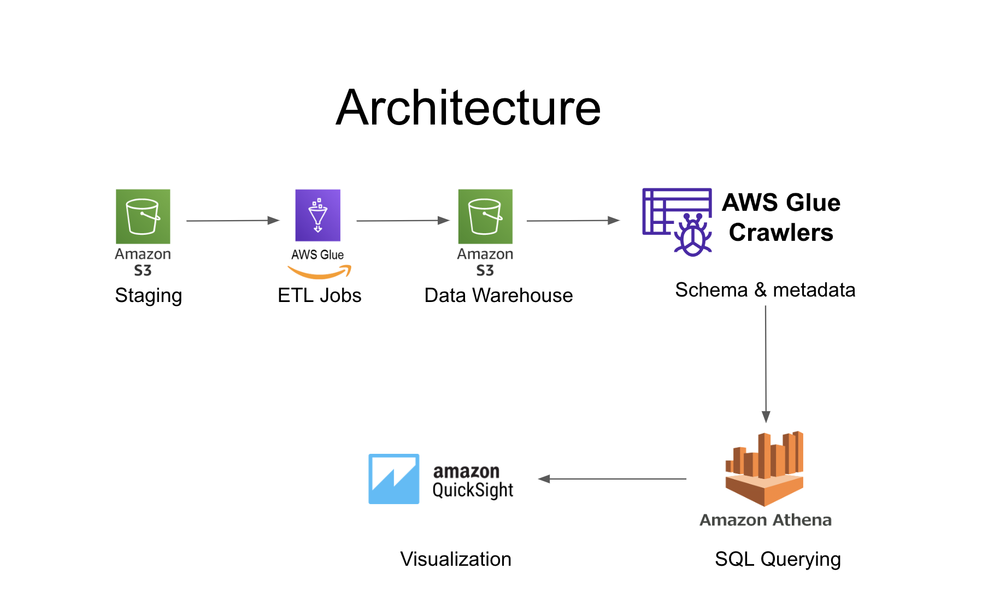

# 🎵 Spotify Data Pipeline with AWS Glue and QuickSight

## 🚀 Project Overview  
This project implements an end-to-end **ETL pipeline** for processing and analyzing **Spotify data** using AWS services. The pipeline efficiently:

- **Extracts** raw data from **Amazon S3** (staging).
- **Transforms** the data using **AWS Glue**.
- **Loads** the transformed data into a structured **data warehouse**.
- **Queries** the data using **Amazon Athena**.
- **Visualizes** insights with **Amazon QuickSight**.

This automated pipeline enables **metadata management, serverless querying, and real-time analytics**, empowering stakeholders to gain valuable insights into **user behavior** and **music trends**.

---

## 🏗 Architecture Overview  


---

## 🔧 Setup Guide  

### ✅ Prerequisites  
Ensure you have the following AWS resources:  
- An **AWS account** with necessary permissions.  
- **S3 Buckets** for **staging** and **data warehouse** storage.  
- Configured **AWS Glue, Athena, and QuickSight** permissions.  

---

## 📌 Steps to Reproduce  

### 📂 1. Upload Data to Amazon S3  

#### 🗂 S3 Bucket Structure  

#### 📌 Staging Bucket  
- **Name:** `staging`  
- **Purpose:** Holds raw Spotify data before ETL processing.  
- **Organization:** Raw data files are uploaded to the root directory, each file representing a different data source.  

#### 📌 Data Warehouse Bucket  
- **Name:** `warehouse`  
- **Purpose:** Stores **transformed** Spotify data for querying and visualization.  
- **Organization:** Data is categorized into folders for different datasets.  

#### 🔒 Access & Security Best Practices  
- **IAM Policies:** Only authorized users/roles can access buckets.  
- **Encryption:** Data is **encrypted at rest** using AWS S3 encryption.  
- **Versioning:** Enabled to **track changes** and prevent accidental data loss.  
- **Lifecycle Policies:** Automates data movement to **cheaper storage tiers**.  

---

### 🛠 2. Set Up AWS Glue Jobs  
- Configure AWS Glue jobs for **data transformation**.  
- Use provided [ETL scripts & configurations](glue_jobs/).  

---

### 🔄 3. Run AWS Glue Crawler  
- Automatically discovers and catalogs data schema.  

---

### 📊 4. Query Data with Amazon Athena  

#### 📝 Example Query  
```sql
SELECT artist_id, track_name 
FROM warehouse
WHERE genre = 'LoFi'
ORDER BY streams DESC;

